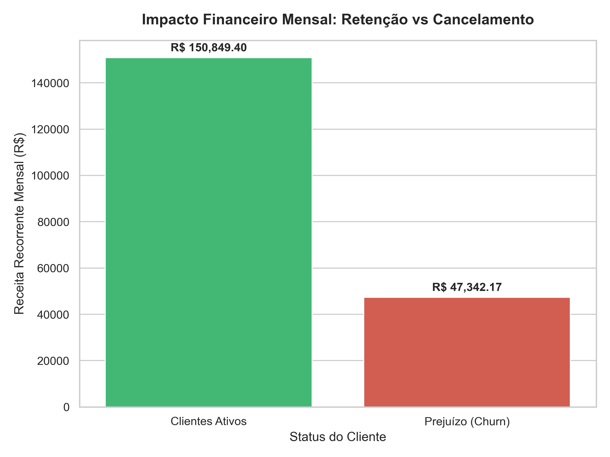

# Análise de Churn e Retenção de Clientes 📊🚀

Este projeto foi desenvolvido com foco em **Inteligência de Mercado** e **Analytics** para identificar gargalos operacionais e financeiros em uma operação de e-commerce fictícia com 1.000 clientes. O objetivo principal é extrair insights acionáveis para apoiar a tomada de decisão da diretoria em estratégias de retenção.

## 🔍 O Problema de Negócio
A empresa apresentava uma perda constante de clientes (Churn), mas não tinha visibilidade do impacto financeiro real ou dos fatores que motivavam os cancelamentos.

## 🛠️ Tecnologias Utilizadas
* **Python**: Linguagem principal para manipulação e análise dos dados.
* **Pandas**: Limpeza, estruturação e agregação das métricas de negócio.
* **Matplotlib & Seaborn**: Geração de relatórios visuais e gráficos estatísticos.
* **Excel**: Armazenamento final da base de dados gerada automaticamente via código.

## 📊 Resultados e Insights Extraídos
Após o processamento dos dados com Python, identificamos os seguintes pontos críticos:

* **Diagnóstico Geral**: A empresa opera com uma **Taxa de Churn de 24.60%** (246 cancelamentos em uma base de 1.000 clientes).
* **Impacto Financeiro**: Os cancelamentos geram um **prejuízo mensal de R$ 47.342,17** em Receita Recorrente Mensal (MRR).
* **Fator de Satisfação (Gargalo)**: Clientes ativos possuem uma média de satisfação de **3.55 de 5**, enquanto os clientes que cancelaram possuem média de **1.45 de 5**, indicando problemas severos na jornada de atendimento ou uso do produto.
* **Tempo de Contrato**: O Churn é mais severo em clientes mais novos, concentrando-se antes da média de 27.5 meses de contrato.

## 📈 Visualização do Impacto Financeiro
Abaixo está o gráfico gerado automaticamente pelo script Python que ilustra o tamanho do prejuízo em relação ao faturamento atual da empresa:

---
*Projeto desenvolvido por André Luis para portfólio de transição de carreira em Inteligência de Mercado e Análise de Dados.*